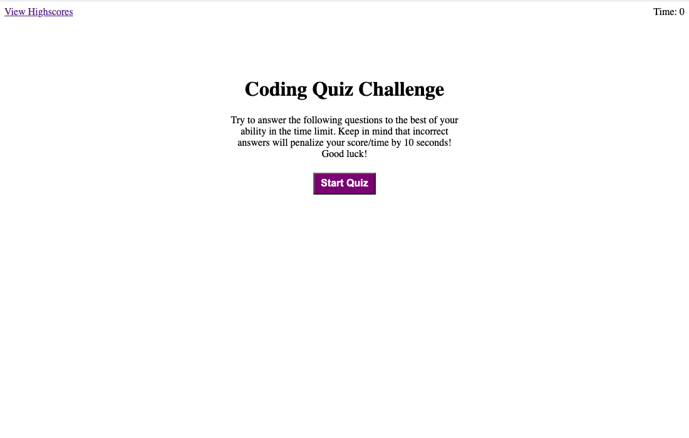

# Code Quiz

The Code Quiz is an application that allows the user to test their knowledge through basic multiple-choice coding questions in a game-like setting. This quiz includes a timer which can decrease in time with a wrong answer and calculates your score once it is over with. The user's high scores are stored and shown in the 'View Highscores' link on the top right of the screen. This application was created through HTML, CSS, Javascript, and Web APIs. 

## Screenshot

## Deploy Link

[Deployed link](https://kishanshah98.github.io/Code-Quiz/)

